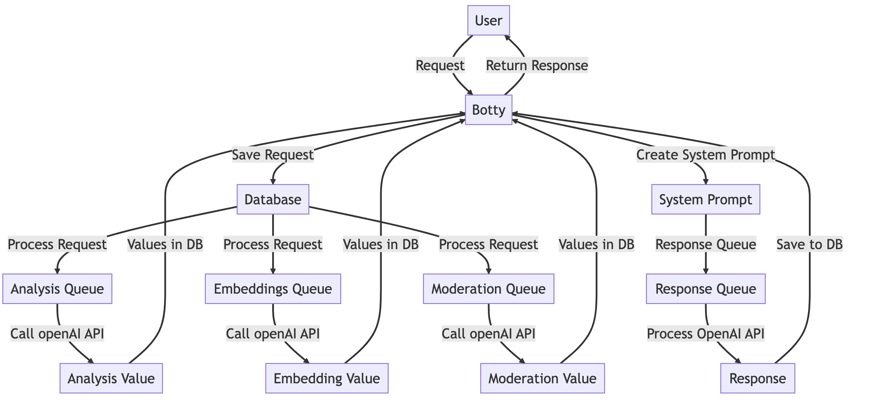
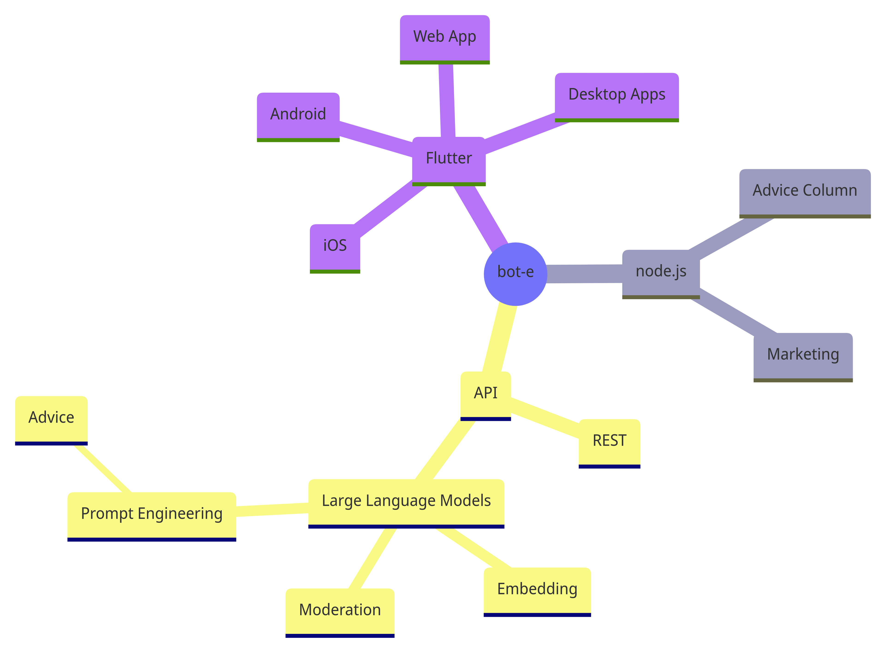

# Human Advice is Overrated


## MVP TODO:

- Finish TOS
- finish comments
    - do not refresh page
- change image_url to use full domain
- Build Server
    - Node.js DONE
    - nginx
        -SSL certificate
    - Postgresql - DONE
        - pgVector - DONE
        - backups
    - Python 3.9 
        - openAI - stuck on gcc12
        - Flask/Gunicorn
        - bot-e Daemon
            - logging
            - Supervisor
- Transfer domain
    - Oct 4
- Add LLC stuff
- Email Marketing
    - capture email addresses?

Backlog:
    - Flutter App
    - Varnish
    - Email Marketing
    - Create Social Media Presence
        - Instagram
        - LinkedIn
        - TikTok
        - Facebook

Advice Request Message Flow:



Mind Map


```
mindmap
  root((bot-e))
    Flutter
        iOS
        Android
        Web App
        Desktop Apps
    FreeBSD
        Email Server
            Newsletter
        Postgresql
            pgVector
            full text search
        bot-e Daemond
            Prompt Engineering
                advice
        Varnish Cache
            Flask/Gunicorn API
                Flutter/MVP Endpoint
                    Browse/Search
                New Question
                    OpenAI
                        Moderation
                        Embedding
            Node.js Web server
                MVP bot-e App
                Marketing
                Advice column
```


## Postgresql setup

- install Postgresql
- install pgVector
```
createdb bot-e
```
- execute data/schema.sql
- execute data/functions.sql

## Website setup

The code anticipates the development version of node.js is running on port 3000
use npm to install the packages in bot-e/web/packages.json and use npm start
to start the dev server. a symbolic link is required

```
ln -s images/questions web/public/images/questions
```

## API setup

The express app expects an api server at localhost:6464 
Setup commands:

```
cd bot-e
python -m venv .venv
source .venv/bin/activate
pip install -r requirements.txt
python api.py
# when testing gunicorn 
# gunicorn -b localhost:6464 --reload api:app
```

## Bot-E Daemon

In development, a long-running python process is needed to 
execute the api calls when question new records are inserted into the database. 
To start this process run these commands:

```
cd bot-e
python -m venv .venv
source .venv/bin/activate
pip install -r requirements.txt
./bote.py
```


