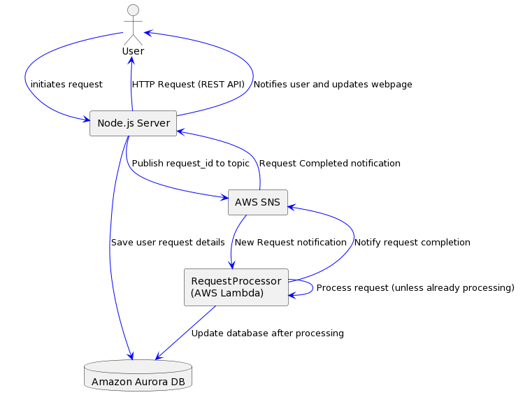

# Human Advice is Overrated



## OS X homebrew packages:
- node

## OX X Installation Instructions for node.js

```bash
cd askbotty/
npm Install
npm install -g node-dev
npm start
open --url http://localhost:3000/

```

## Running docs/BottyDocs.ipynb

update python3 if necessary, then create a virtual environment.

```bash
python -m venv .venv
source .venv/bin/activate
pip install jupyterlab
jupyter-lab docs/BottyDocs.ipynb
```

The last command will open a jupyterlabs server.  To close the virtual python 
server use the "deactivate" command.

